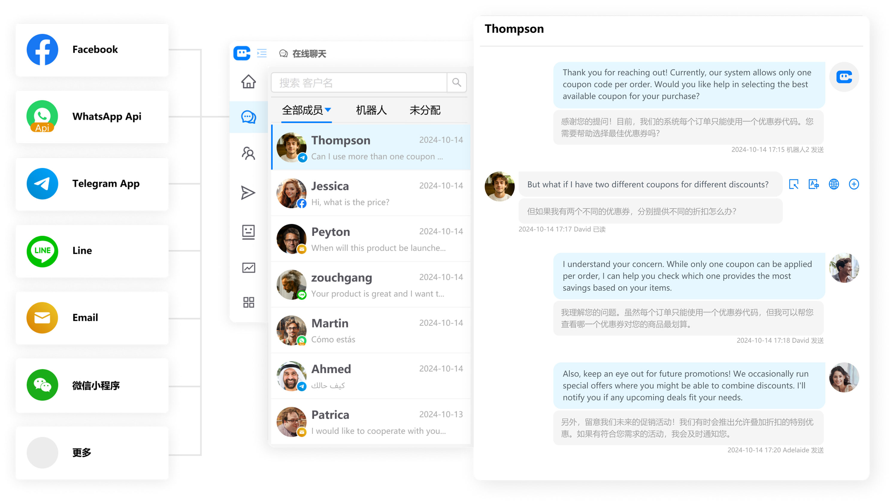
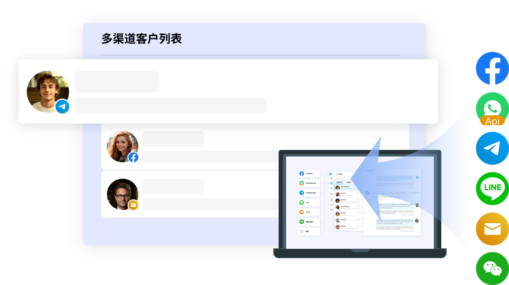
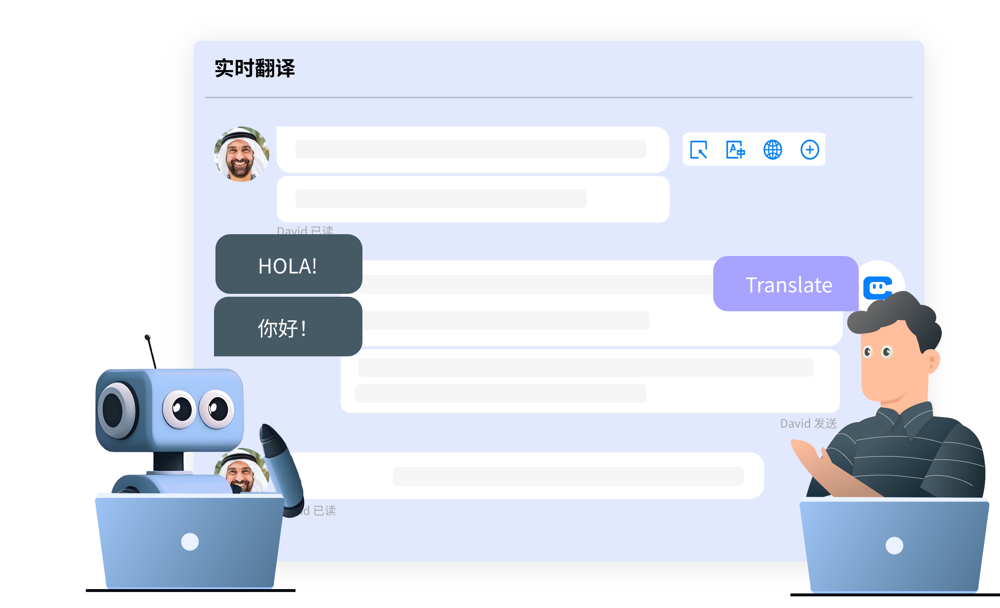
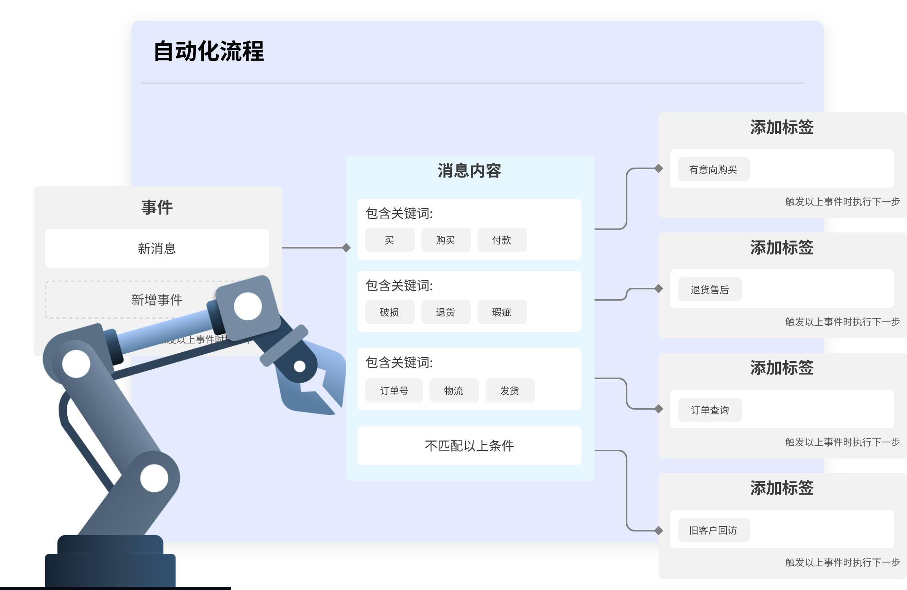
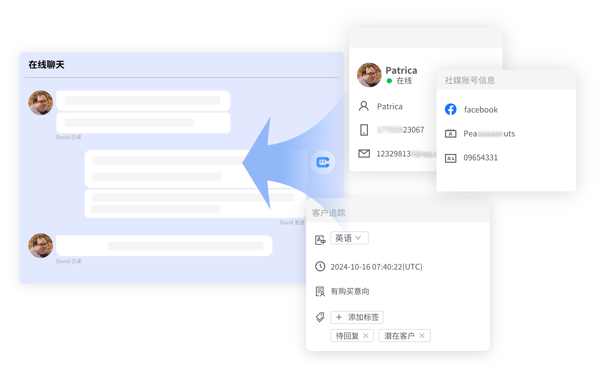
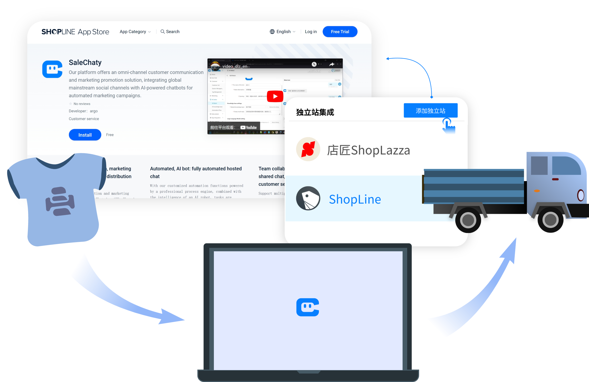

# SaleChaty — AI跨境智能客服平台

## 📌 项目简介

SaleChaty 是一个基于大语言模型（LLM）的全渠道智能客户营销联络平台，专为跨境出海企业打造。它聚合在线聊天（Livechat）以及 WhatsApp、Facebook Messenger、Instagram、Telegram、Line、微信、Email 等全球主流社交媒体渠道，通过 AI + 人工的方式，帮助企业解决出海过程中面临的语种、时差、文化、网络等难题，提升品牌形象及客户满意度，降低投诉、退货及拒付率，提升广告转化率。

## 🚀 核心功能

### 1. 全渠道聚合沟通

- **多渠道集中管理**：统一管理网页聊天插件、WhatsApp（APP + API）、Facebook Messenger 及帖子、Telegram（APP）、Instagram、Line、Slack、微信、TikTok、邮件等 12+ 主流社媒渠道。
- **一分钟快速接入**：多点触达，快速开启与客户的互动，沉淀企业私域流量，打造专属客户资产。
- **支持多种消息类型**：文字、图片、语音、表情、视频、文件等。

*多个社媒渠道消息汇聚至统一工作台*

*12+ 主流社媒渠道一键接入*

### 2. AI 智能机器人

- **基于大语言模型的智能对话**：像人工客服一样理解客户表述中的情感需求，具备跨场景语义理解能力，轻松识别客户意图，解决多轮对话语义难题。
- **专业知识库问答**：搭载企业专属知识库，快速响应客户常见问题，自动回答订单查询、物流状态等高频咨询。
- **全自动托管聊天**：借助专业的流程引擎和 AI 机器人智能加持，全自动执行任务，可帮助企业减少 90% 以上的重复工作量。
- **智能问题识别与分类**：自动识别客户咨询意图，并按照预设规则自动分配处理。

*AI 机器人自动识别意图并回复*

### 3. 多语种 & 实时翻译

- **双向自动翻译**：开启后系统自动识别客户语言并实时翻译双方消息，支持 23 种以上语言。
- **单句翻译 & 语言识别**：支持对单条消息即时翻译，并可快速识别客户所用语言，便于精准回应。
- **译文预览与编辑**：输入内容后可预览翻译结果，支持手动编辑优化后再发送，确保表达准确专业。

*双语对话实时互译，支持 23+ 种语言*

### 4. 自动化流程引擎

- **智能营销自动化**：自动成交、自动发送消息、自动处理差评、自动添加客户标签、智能成员分配。
- **群发 & 代发计划**：支持 WhatsApp 模板、邮件模板等多种形式的批量营销推送，持续激活客户需求。
- **智能评论管理**：自动屏蔽恶意差评，引导用户私聊留下正向评价，优化品牌口碑。

*智能营销自动化流程*

*群发与代发营销推送*

### 5. 客户画像与数据分析

- **精准客户画像**：同步客户行为轨迹、历史客户数据、企业客户数据，精准捕捉每一位潜在客户，预见未来市场趋势。
- **多维度数据分析**：以可视化图表形式呈现关键指标和趋势，帮助轻松制定营销计划。
- **客户标签管理**：可自定义客户标签，高效管理客户列表，快速筛选目标客户群体。

*多维度客户画像与数据分析图表*

### 6. 团队协作与管理

- **智能会话分配**：支持多种分配策略，按策略将客户分配给客服，避免客服工作量分配不均。
- **共享聊天 & 会话管理**：团队成员可共享聊天会话，集中管理客户会话信息，支持审查聊天质量并打上会话标签。
- **快速回聊**：支持对客户快速发起回聊，持续跟进客户需求。

### 7. 移动办公

- **随时随地沟通**：通过移动端随时随地和全球客户无障碍沟通，及时响应客户咨询。
- **移动端营销推送**：随时随地针对客户群体推送各渠道的营销计划。

*移动端随时响应全球客户咨询*

*电商独立站无缝集成*

## 💰 定价方案

| 功能 | 免费版 | Pro 版 |
|------|--------|--------|
| 价格 | 免费 | $9 /月 |
| 成员数 | 1 个 | 1 个 |
| 社媒账号数 | 1 个 | 10 个 |
| 云设备数 | 0 个 | 1 个 |
| 会话额度 | 1000 个 | 不限 |
| 自动化触发次数 | 500/月 | 不限 |
| 机器人数 | 1 个 | 5 个 |
| 知识库文档 | 50MB | 500MB |
| 话术条数 | 100 个 | 5000 个 |
| 聊天记录保存 | 30 天 | 1 年 |
| 售后服务 | 基础支持 | 邮件、电话、社群支持 |

*所有费用以 USD 结算，定期费用以 30 天为周期收费。*

## 🏢 适用行业

SaleChaty 适用于几乎所有行业，包括但不限于：
- 电商独立站
- 教育培训
- 餐饮旅游
- 金融服务
- 游戏服务商
- 超市售后

## 📈 产品价值

通过 AI + 人工的协同模式，SaleChaty 帮助企业：
- ✅ 提升客服工作效率与客户满意度
- ✅ 降低投诉率、退货率及拒付率
- ✅ 提升广告投放转化率
- ✅ 解决出海时的语种、时差、文化、网络障碍
- ✅ 已服务全球超过 1 万家企业

## 🔗 联系方式

- **官方网站**：[www.salechaty.com](https://www.salechaty.com)
- **服务邮箱**：[service@argofly.com](mailto:service@argofly.com)
- **咨询电话**：13265519620
- **开发公司**：广州阿尔戈信息科技有限公司
- **应用商店链接**：[Shopify 应用商店](https://apps.shopify.com/salechaty) | [Shoplazza 应用商店](https://appstore.shoplazza.com/listing/salechaty/)

## 📄 相关资源

- **WordPress 插件**：[SaleChaty – AI Chatbot](https://wordpress.org/plugins/salechaty-ai-chatbot/)
- **Product Hunt**：[SaleChaty on Product Hunt](https://www.producthunt.com/products/salechaty)

---

*最后更新时间：2026年4月*